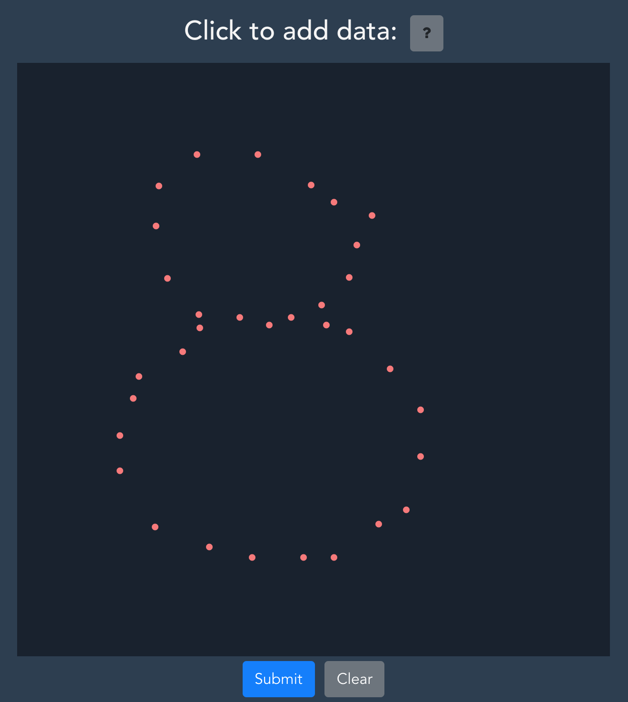
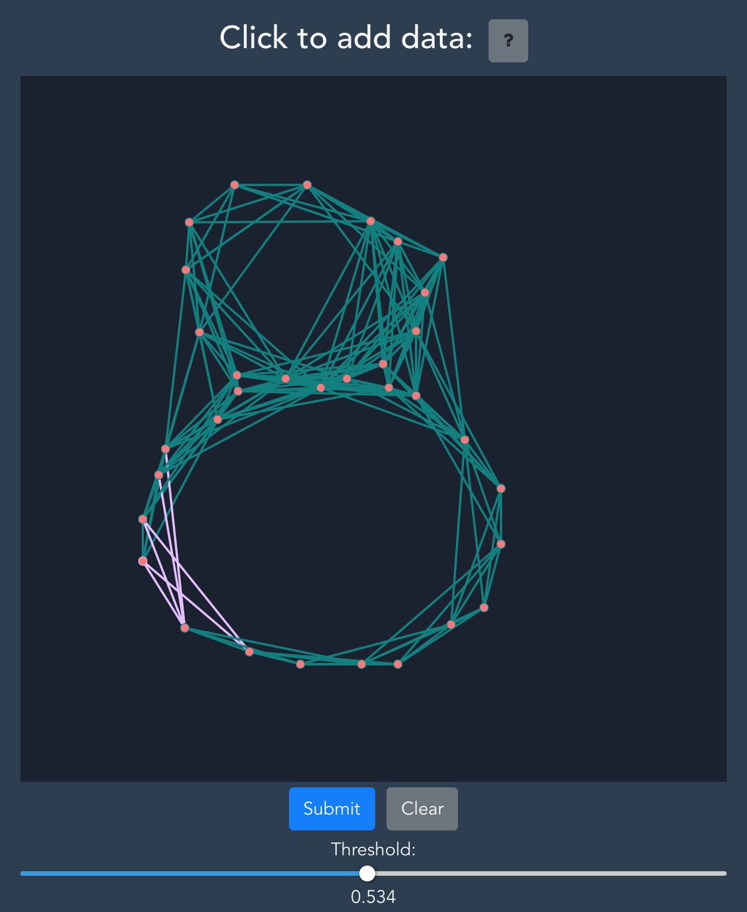

# Ripser-wrap

_A UI build around Scikit's Ripser module to provide more insight into persistence cohomology._

## Installation

This app was build upon the following template: https://github.com/gtalarico/flask-vuejs-template. 
Please consult this page for the main dependencies and installation process.

## Usage

It is possible to both create a dataset in the clickable area and upload a csv file:

For both there is a limit of roughly 26 mb, as seen in `app/config.py`.

After submitting the data, the server returns the result of `ripser.ripser()` and everything is formatted.
It is possible to view the cocycles by increasing the threshold until you reach the birth of a cocycle, 
as seen in the persistence diagram in dimension 1. All edges get assigned a color corresponding to the
image in the integers under the cocycle.

## Demo
[Live Demo](https://ripser-wrap.herokuapp.com/)
